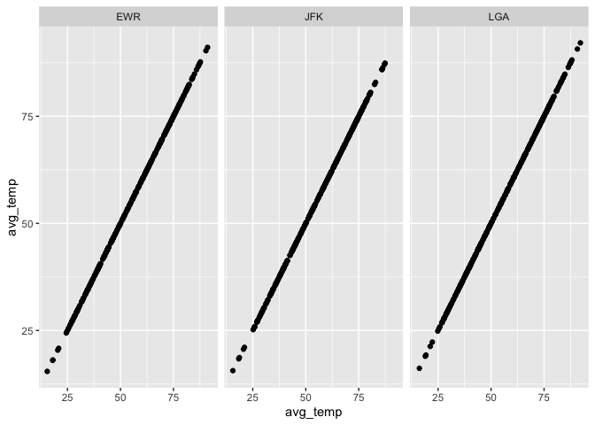

------------------------------------------------------------------------

Practice Exam
=============

This practice exam asks you to do several code wrangling tasks that we
have done in class so far.

Clone this repo into Rstudio and fill in the necessary code. Then,
commit and push to github. Finally, turn in a link to canvas.

    ## ── Attaching packages ────────── tidyverse 1.3.0 ──

    ## ✓ ggplot2 3.2.1     ✓ purrr   0.3.3
    ## ✓ tibble  2.1.3     ✓ dplyr   0.8.3
    ## ✓ tidyr   1.0.2     ✓ stringr 1.4.0
    ## ✓ readr   1.3.1     ✓ forcats 0.4.0

    ## ── Conflicts ───────────── tidyverse_conflicts() ──
    ## x dplyr::filter() masks stats::filter()
    ## x dplyr::lag()    masks stats::lag()

Make a plot with three facets, one for each airport in the weather data.
The x-axis should be the day of the year (1:365) and the y-axis should
be the mean temperature recorded on that day, at that airport.

    library(lubridate)

    ## 
    ## Attaching package: 'lubridate'

    ## The following object is masked from 'package:base':
    ## 
    ##     date

    weather %>% mutate(day_of_year = yday(time_hour)) %>%
      group_by(day_of_year, origin) %>%
      summarize(avg_temp=mean(temp), na.rm=T) %>%
      ggplot(mapping=aes(x=avg_temp, y=avg_temp)) +
      geom_point() +
      facet_wrap(~origin)

    ## Warning: Removed 1 rows containing missing values (geom_point).

Make a non-tidy matrix of that data where each row is an airport and
each column is a day of the year.

    weather %>% mutate(day_of_year = yday(time_hour)) %>%
      select(day_of_year, origin, temp) %>%
      group_by(day_of_year, origin) %>%
      summarize(avg_temp=mean(temp), na.rm=T) %>%
      pivot_wider(names_from=day_of_year, values_from=avg_temp)

    ## # A tibble: 3 x 366
    ##   origin na.rm   `1`   `2`   `3`   `4`   `5`   `6`   `7`   `8`   `9`  `10`  `11`
    ##   <chr>  <lgl> <dbl> <dbl> <dbl> <dbl> <dbl> <dbl> <dbl> <dbl> <dbl> <dbl> <dbl>
    ## 1 EWR    TRUE   36.8  28.7  29.6  34.3  36.6  39.9  40.3  38.6  42.1  43.6  42.0
    ## 2 JFK    TRUE   36.9  28.6  30.1  34.7  36.8  39.3  40.1  39.4  42.7  43.6  41.3
    ## 3 LGA    TRUE   37.2  28.8  30.3  35.8  38.3  41.0  41.4  42.3  44.9  44.3  40.3
    ## # … with 353 more variables: `12` <dbl>, `13` <dbl>, `14` <dbl>, `15` <dbl>,
    ## #   `16` <dbl>, `17` <dbl>, `18` <dbl>, `19` <dbl>, `20` <dbl>, `21` <dbl>,
    ## #   `22` <dbl>, `23` <dbl>, `24` <dbl>, `25` <dbl>, `26` <dbl>, `27` <dbl>,
    ## #   `28` <dbl>, `29` <dbl>, `30` <dbl>, `31` <dbl>, `32` <dbl>, `33` <dbl>,
    ## #   `34` <dbl>, `35` <dbl>, `36` <dbl>, `37` <dbl>, `38` <dbl>, `39` <dbl>,
    ## #   `40` <dbl>, `41` <dbl>, `42` <dbl>, `43` <dbl>, `44` <dbl>, `45` <dbl>,
    ## #   `46` <dbl>, `47` <dbl>, `48` <dbl>, `49` <dbl>, `50` <dbl>, `51` <dbl>,
    ## #   `52` <dbl>, `53` <dbl>, `54` <dbl>, `55` <dbl>, `56` <dbl>, `57` <dbl>,
    ## #   `58` <dbl>, `59` <dbl>, `60` <dbl>, `61` <dbl>, `62` <dbl>, `63` <dbl>,
    ## #   `64` <dbl>, `65` <dbl>, `66` <dbl>, `67` <dbl>, `68` <dbl>, `69` <dbl>,
    ## #   `70` <dbl>, `71` <dbl>, `72` <dbl>, `73` <dbl>, `74` <dbl>, `75` <dbl>,
    ## #   `76` <dbl>, `77` <dbl>, `78` <dbl>, `79` <dbl>, `80` <dbl>, `81` <dbl>,
    ## #   `82` <dbl>, `83` <dbl>, `84` <dbl>, `85` <dbl>, `86` <dbl>, `87` <dbl>,
    ## #   `88` <dbl>, `89` <dbl>, `90` <dbl>, `91` <dbl>, `92` <dbl>, `93` <dbl>,
    ## #   `94` <dbl>, `95` <dbl>, `96` <dbl>, `97` <dbl>, `98` <dbl>, `99` <dbl>,
    ## #   `100` <dbl>, `101` <dbl>, `102` <dbl>, `103` <dbl>, `104` <dbl>,
    ## #   `105` <dbl>, `106` <dbl>, `107` <dbl>, `108` <dbl>, `109` <dbl>,
    ## #   `110` <dbl>, `111` <dbl>, …

For each (airport, day) contruct a tidy data set of the airport’s
“performance” as the proportion of flights that departed less than an
hour late.

    performance<-flights %>% mutate(day_of_year = yday(time_hour)) %>%
      mutate(major_delay=ifelse(dep_delay<60, 1, 0)) %>%
      group_by(origin, day_of_year) %>%
      summarize(major_delay=mean(major_delay, na.rm=T)) %>%
      mutate(minor_delay=(1-major_delay)*100)
    performance

    ## # A tibble: 1,095 x 4
    ## # Groups:   origin [3]
    ##    origin day_of_year major_delay minor_delay
    ##    <chr>        <dbl>       <dbl>       <dbl>
    ##  1 EWR              1       0.918        8.22
    ##  2 EWR              2       0.837       16.3 
    ##  3 EWR              3       0.979        2.10
    ##  4 EWR              4       0.935        6.53
    ##  5 EWR              5       0.966        3.38
    ##  6 EWR              6       0.95         5.  
    ##  7 EWR              7       0.921        7.89
    ##  8 EWR              8       0.982        1.81
    ##  9 EWR              9       0.976        2.39
    ## 10 EWR             10       0.980        2.04
    ## # … with 1,085 more rows

Construct a tidy data set to that give weather summaries for each
(airport, day). Use the total precipitation, minimum visibility, maximum
wind\_gust, and average wind\_speed.

    weather_summary<-weather %>% mutate(day_of_year = yday(time_hour)) %>%
      select(day_of_year, origin, precip, visib, wind_gust, wind_speed) %>%
      group_by(day_of_year, origin) %>%
      mutate(wind_gust=ifelse(is.na(wind_gust), 0, wind_gust)) %>%
      summarize(total_precip=sum(precip, na.rm=T), min_visib=min(visib, na.rm=T),  max_wind=max(wind_gust, na.rm=T), avg_wind=mean(wind_speed, na.rm=T)) %>%
      mutate(max_wind=ifelse(max_wind==0, NA, max_wind))
    weather_summary

    ## # A tibble: 1,092 x 6
    ## # Groups:   day_of_year [364]
    ##    day_of_year origin total_precip min_visib max_wind avg_wind
    ##          <dbl> <chr>         <dbl>     <dbl>    <dbl>    <dbl>
    ##  1           1 EWR               0        10     26.5    13.2 
    ##  2           1 JFK               0        10     35.7    15.4 
    ##  3           1 LGA               0         9     28.8    15.4 
    ##  4           2 EWR               0        10     26.5    10.9 
    ##  5           2 JFK               0        10     29.9    14.5 
    ##  6           2 LGA               0        10     23.0    13.6 
    ##  7           3 EWR               0        10     NA       8.58
    ##  8           3 JFK               0        10     NA      11.7 
    ##  9           3 LGA               0        10     23.0    11.1 
    ## 10           4 EWR               0        10     31.1    14.0 
    ## # … with 1,082 more rows

Construct a linear model to predict the performance of each
(airport,day) using the weather summaries and a “fixed effect” for each
airport. Display the summaries.

    performance_weather<-full_join(performance, weather_summary) %>%
      mutate(ewr=ifelse(origin=="EWR", 1, 0), jfk=ifelse(origin=="JFK", 1, 0), lga=ifelse(origin=="LGA", 1, 0))

    ## Joining, by = c("origin", "day_of_year")

    lm<-lm(minor_delay~total_precip + min_visib + max_wind + avg_wind + ewr + jfk + lga, data=performance_weather)
    lm

    ## 
    ## Call:
    ## lm(formula = minor_delay ~ total_precip + min_visib + max_wind + 
    ##     avg_wind + ewr + jfk + lga, data = performance_weather)
    ## 
    ## Coefficients:
    ##  (Intercept)  total_precip     min_visib      max_wind      avg_wind  
    ##     11.31408       4.47060      -0.80582       0.10144      -0.06806  
    ##          ewr           jfk           lga  
    ##      2.11927      -0.05453            NA

Repeat the above, but only for EWR. Obviously, exclude the fixed effect
for each airport.

    performance_weather_ewr<-performance_weather %>%
      filter(origin=="EWR")
    lm2<-lm(minor_delay~total_precip + min_visib + max_wind + avg_wind, data=performance_weather_ewr)
    lm2

    ## 
    ## Call:
    ## lm(formula = minor_delay ~ total_precip + min_visib + max_wind + 
    ##     avg_wind, data = performance_weather_ewr)
    ## 
    ## Coefficients:
    ##  (Intercept)  total_precip     min_visib      max_wind      avg_wind  
    ##     11.24681       4.33820      -0.87308       0.17445       0.01029
